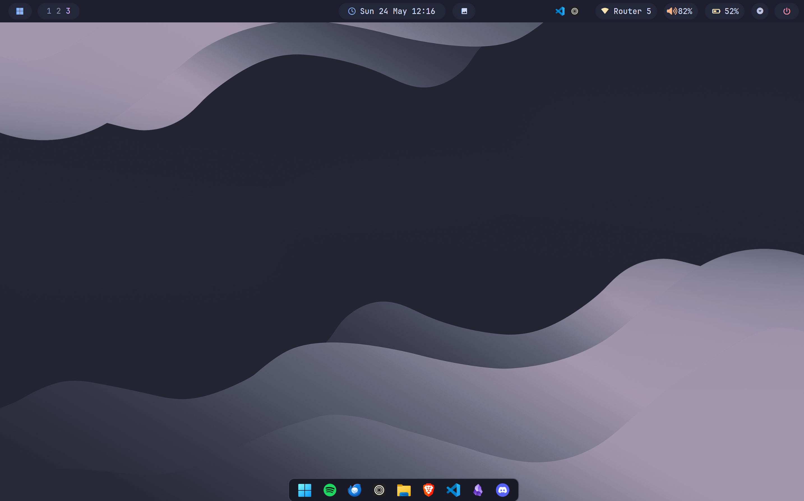

<h1 align="center">🌾 windots</h1>

<div align="center">
  
</div>

---

## 🌷 About

Hey there! 👋

Welcome to **windots**! This repo contains dotfiles and configurations for a customized Windows environment, designed for users who want a riced, efficient, and Unix-like experience on Windows.

This setup transforms Windows into a cleaner, more cohesive environment with tiling window management, custom terminal styling, and thoughtful UI tweaks. Whether it's for productivity, aesthetics, or a better workflow, everything here is aimed at making Windows feel less like a chore and more tailored to your preferences.

If you're into [**r/unixporn**](https://reddit.com/r/unixporn)-style setups and want something similar on Windows, this might just help you get started!

## ✨ Features

- 🪟 **GlazeWM** tiling window manager setup
- ❄️ Beautiful **YASB** status bar config
- 🌸 Minimal **VSCode** setup with Catppuccin theme
- \>_ Sleek **Windows Terminal** config with custom styling
- 🐚 **PowerShell** customization with profile
- 🎨 **Oh My Posh** theme for beautiful prompts
- 🔇 **AutoHotkey** volume & mute utilities
- 🦅 Themeable **Start menu, Taskbar, and Notification center** via Windhawk
- 🎯 **Nile Soft Shell** menu customization
- 🎵 **Spicetify** Catppuccin-themed Spotify
- 🎬 **mpv** powerful video player configs
- ✏️ **Zed** editor configs
- 💬 **Vencord** Discord theme
- 🐈 [**Catppuccin**](https://github.com/catppuccin) everywhere
- 💫 Beautiful [**Wallpapers**](walls/)

---

## 🌸 Core System Info

- **OS:** [Windows 11](https://www.microsoft.com/en-us/windows/windows-11) 🪟
- **WM:** [GlazeWM](https://github.com/glzr-io/glazewm) ✨
- **Shell:** [PowerShell](https://learn.microsoft.com/en-us/powershell/) 🐚
- **Terminal Emulator:** [Windows Terminal](https://github.com/microsoft/terminal) >_
- **Panel:** [YASB](https://github.com/amnweb/yasb) ❄️
- **Editor:** [Zed](https://zed.dev/) ⌨️ & [VSCode](https://code.visualstudio.com/) ⌨️
- **Automation:** [AutoHotkey](https://www.autohotkey.com/) 🤖
- **System Fetch:** [Fastfetch](https://github.com/fastfetch-cli/fastfetch) 📝
- **Colorscheme:** [Catppuccin](https://catppuccin.com/) 🎨

---

### ℹ️ Complete System Configuration

Here's all the information about my setup:

> [!NOTE]
> Apps with config files included in the repo are marked with ⚙️

<details>
	
<summary>🪟 <b>System</b></summary>

<br>

| 📚 Entry                           	 | ✨ App                  |
|----------------------------------------|--------------------------|
| **OS** 				 				 | [Windows 11](https://www.microsoft.com/en-us/windows/windows-11) |
| **Window Manager** 			 		 | [GlazeWM](https://github.com/glzr-io/glazewm) [⚙️](configs/glazewm/config.yaml) |
| **Status Bar** 				 		 | [YASB](https://github.com/amnweb/yasb) [⚙️](configs/yasb/) |
| **UI Mods** 				 			 | [Windhawk](https://windhawk.net/) [⚙️](configs/windhawk/) |
| **Shell Menu** 				 		 | [Nile Soft Shell](https://www.nilessoft.com/) [⚙️](configs/nilesoft/shell.nss) |
| **Automation** 				 		 | [AutoHotkey](https://www.autohotkey.com/) [⚙️](configs/autohotkey/) |

</details>

<details>
	
<summary>🖥️ <b>Terminal & CLI</b> </summary>

<br>

| 📚 Entry                           	 | ✨ App                  |
|----------------------------------------|--------------------------|
| **Shell**                              | [PowerShell](https://learn.microsoft.com/en-us/powershell/) [⚙️](configs/powershell/Microsoft.PowerShell_profile.ps1) |
| **Terminal Emulator**                  | [Windows Terminal](https://github.com/microsoft/terminal) [⚙️](configs/terminal/settings.json) |
| **Shell Prompt**                       | [Oh My Posh](https://ohmyposh.dev/) [⚙️](configs/ohmyposh/zen.toml) |
| **System Fetch**                       | [Fastfetch](https://github.com/fastfetch-cli/fastfetch) [⚙️](configs/fastfetch/) |

</details>

<details>
	
<summary>🖱️ <b>GUI Applications</b></summary>

<br>

| 📚 Entry                           	 | ✨ App                  |
|----------------------------------------|--------------------------|
| **Text Editor**              		     | [Zed](https://zed.dev/) [⚙️](configs/zed/) & [VSCode](https://code.visualstudio.com/) [⚙️](configs/vscode/settings.json) |
| **Media Player**              		 | [qBittorrent](https://www.qbittorrent.org/) [⚙️](configs/qbittorrent/catppuccin-mocha.qbtheme) |
| **Video Player**              		 | [mpv](https://mpv.io/) [⚙️](configs/mpvplayer/) |
| **Web Browser**               	 	 | [Zen Browser](https://zen-browser.app/) [⚙️](configs/browser/) |
| **Email Client**              		 | [Thunderbird](https://www.thunderbird.net/) [⚙️](configs/thunderbird/) |
| **Spotify Client**           		     | [Spicetify](https://spicetify.app/) [⚙️](configs/spicetify/) |
| **Discord Client**           		     | [Vencord](https://vencord.dev/) [⚙️](configs/vencord/) |
| **File Manager**                       | [File Explorer](https://www.microsoft.com/en-us/windows/file-explorer) [⚙️](configs/explorer/) |

</details>

<details>
	
<summary>🎨 <b>Customizations</b></summary>

<br>

| 📚 Entry                              | ✨ App                  |
|---------------------------------------|---------------------------|
| **Colorscheme**                       | [Catppuccin Mocha](https://catppuccin.com) |
| **Browser**                           | [Zen Browser](https://zen-browser.app) |
| **Font**                  			| [JetBrainsMono Nerd Font](https://www.jetbrains.com/lp/mono/) |
| **Cursor Theme**                      | Custom cursors [⚙️](configs/explorer/cursor/) |
| **Browser Styling**                   | userChrome & userContent CSS [⚙️](configs/browser/) |
| **Shell Enhancement**                 | [Stylus](https://addons.mozilla.org/firefox/addon/styl-us/) [⚙️](configs/stylus/) |
| **Explorer Blur**                     | Windows Explorer transparency [⚙️](configs/explorer/explorer-blur/) |

</details>

---

## 🔧 Setup

> [!WARNING]
> These configs are **not plug-and-play**  
> Cherry-pick what you need. Backup before applying.

<details>
<summary><strong>🪟 GlazeWM</strong></summary><br>

- Install [GlazeWM](https://github.com/glzr-io/glazewm/releases)
- Copy config: [`configs/glazewm/config.yaml`](configs/glazewm/config.yaml)
- Place in: `%APPDATA%\.glzr\glazewm\`

</details>

<details>
<summary><strong>❄️ YASB</strong></summary><br>

**NOTE:** Requires a Nerd Font (JetBrainsMono Nerd Font recommended).

- Install [YASB](https://github.com/amnweb/yasb/releases)
- Copy configs: [`configs/yasb/`](configs/yasb/)
- Place in: `%APPDATA%\yasb\`

</details>

<details>
<summary><strong>⌨️ VSCode</strong></summary><br>

- Install [VSCode](https://code.visualstudio.com/download)
- Copy settings: [`configs/vscode/settings.json`](configs/vscode/settings.json)
- Place in: `%APPDATA%\Code\User\`
- Install [Catppuccin](https://marketplace.visualstudio.com/items?itemName=Catppuccin.catppuccin-vsc) theme

</details>

<details>
<summary><strong>🌐 Zen Browser</strong></summary><br>

**NOTE:** Works on Firefox-based browsers (Zen Browser, Firefox, etc.).

1. Enable stylesheets:
   - Open `about:config`
   - Set `toolkit.legacyUserProfileCustomizations.stylesheets = true`

2. Locate profile folder:
   - Open `about:support`
   - Click **Open Folder** next to Profile Folder

3. Copy configs:
   - [`configs/browser/userChrome.css`](configs/browser/userChrome.css)
   - [`configs/browser/userContent.css`](configs/browser/userContent.css)
   - Place in: `chrome/` subfolder within your profile

</details>

<details>
<summary><strong>🦅 Windhawk</strong></summary><br>

- Install [Windhawk](https://windhawk.net)
- Required mods:
  - Notification Center Styler
  - Start Menu Styler
  - Taskbar Styler

- Copy configs: [`configs/windhawk/`](configs/windhawk/)

Paste configs via:  
**Mod → Advanced → Mod Settings → Load**

</details>

<details>
<summary><strong>🎯 Nile Soft Shell</strong></summary><br>

- Install [Nile Soft Shell](https://www.nilessoft.com/)
- Copy config: [`configs/nilesoft/shell.nss`](configs/nilesoft/shell.nss)
- Place in: `%APPDATA%\Nile Soft Shell\`

</details>

<details>
<summary><strong>>_ Windows Terminal</strong></summary><br>

- Install [Windows Terminal](https://github.com/microsoft/terminal)
- Copy settings: [`configs/terminal/settings.json`](configs/terminal/settings.json)
- Place in: `%LOCALAPPDATA%\Packages\Microsoft.WindowsTerminal_8wekyb3d8bbwe\LocalState\`

</details>

<details>
<summary><strong>🐚 PowerShell</strong></summary><br>

- Install [PowerShell](https://learn.microsoft.com/en-us/powershell/scripting/install/install-powershell)
- Copy profile: [`configs/powershell/Microsoft.PowerShell_profile.ps1`](configs/powershell/Microsoft.PowerShell_profile.ps1)
- Place in: `%PROFILE%` location (run `$PROFILE` in PowerShell to find it)

</details>

<details>
<summary><strong>🎨 Oh My Posh</strong></summary><br>

- Install:
  ```powershell
  winget install JanDeDobbeleer.OhMyPosh
  ```

- Copy theme: [`configs/ohmyposh/zen.toml`](configs/ohmyposh/zen.toml)
- Place in: `%APPDATA%\ohmyposh\themes\`

Theme initialization is included in the PowerShell profile.

</details>

<details>
<summary><strong>📝 Fastfetch</strong></summary><br>

- Install:
  ```powershell
  winget install fastfetch
  ```

- Copy configs: [`configs/fastfetch/`](configs/fastfetch/)
- Place in: `%APPDATA%\fastfetch\`

</details>

<details>
<summary><strong>🤖 AutoHotkey</strong></summary><br>

- Install [AutoHotkey v2](https://www.autohotkey.com/)
- Copy scripts: [`configs/autohotkey/`](configs/autohotkey/)
- Run `AppVol.ahk` or add to startup:
  - Press `Win + R`, type `shell:startup`
  - Create shortcut to `AppVol.ahk`

**Utilities:**
- AppVol.ahk - Application volume quick controls
- mute-global.ahk - Global microphone mute toggle

</details>

<details>
<summary><strong>🎯 qBittorrent</strong></summary><br>

- Install [qBittorrent](https://www.qbittorrent.org/)
- Copy theme: [`configs/qbittorrent/catppuccin-mocha.qbtheme`](configs/qbittorrent/catppuccin-mocha.qbtheme)
- Place in: `%APPDATA%\qBittorrent\themes\`

</details>

<details>
<summary><strong>🎬 mpv Player</strong></summary><br>

- Install [mpv](https://mpv.io/)
- Copy configs: [`configs/mpvplayer/`](configs/mpvplayer/)
- Place in: `%APPDATA%\mpv\`

</details>

<details>
<summary><strong>📧 Thunderbird</strong></summary><br>

- Install [Thunderbird](https://www.thunderbird.net/)
- Copy Chrome theme: [`configs/thunderbird/chrome/`](configs/thunderbird/chrome/)
- Place in: `%APPDATA%\Thunderbird\Profiles\<profile>\chrome\`

</details>

<details>
<summary><strong>🎵 Spicetify</strong></summary><br>

- Install [Spicetify](https://spicetify.app/)
- Copy config: [`configs/spicetify/spicetify-marketplace.json`](configs/spicetify/spicetify-marketplace.json)
- Place in: `%APPDATA%\spicetify\`

</details>

<details>
<summary><strong>💬 Vencord</strong></summary><br>

- Install [Vencord](https://vencord.dev/)
- Copy settings: [`configs/vencord/vencord-settings.json`](configs/vencord/vencord-settings.json)
- Import in Vencord settings

</details>

<details>
<summary><strong>✏️ Zed</strong></summary><br>

- Install [Zed](https://zed.dev/)
- Copy configs: [`configs/zed/`](configs/zed/)
- Place in: `%APPDATA%\Zed\`

</details>

<details>
<summary><strong>🖱️ File Explorer Customization</strong></summary><br>

**Cursor Theme:**
- Copy cursor files: [`configs/explorer/cursor/`](configs/explorer/cursor/)
- Place in: `%WINDIR%\Cursors\`
- Or use via: Settings → Ease of Access → Cursor & pointer

**Explorer Blur:**
- Copy config: [`configs/explorer/explorer-blur/`](configs/explorer/explorer-blur/)
- Run `register.cmd` to enable (requires admin)

**Explorer Theme:**
- Copy theme files: [`configs/explorer/theme/`](configs/explorer/theme/)
- Place in: `%APPDATA%\Microsoft\Windows\Themes\`

</details>

---

## 🔇 AutoHotkey Keybindings

Quick reference for AutoHotkey scripts:

**Utilities:**
- [`configs/autohotkey/AppVol.ahk`](configs/autohotkey/AppVol.ahk) - Application volume quick controls
- [`configs/autohotkey/mute-global.ahk`](configs/autohotkey/mute-global.ahk) - Global microphone mute toggle

---

## 🔗 Directory Structure

```
windots/
├── configs/
│   ├── autohotkey/              # AutoHotkey volume & mute scripts
│   ├── browser/                 # Firefox userChrome & userContent
│   ├── explorer/                # Cursors, themes, blur effects
│   ├── fastfetch/               # System fetch configs
│   ├── glazewm/                 # Tiling window manager
│   ├── mpvplayer/               # Video player config
│   ├── nilesoft/                # Shell menu customization
│   ├── ohmyposh/                # Prompt theme
│   ├── powershell/              # PowerShell profile
│   ├── qbittorrent/             # Torrent client theme
│   ├── spicetify/               # Spotify customization
│   ├── stylus/                  # Firefox styling
│   ├── terminal/                # Windows Terminal settings
│   ├── thunderbird/             # Email client chrome theme
│   ├── vencord/                 # Discord theme settings
│   ├── vscode/                  # VS Code settings
│   ├── windhawk/                # Windows UI mods
│   ├── yasb/                    # Status bar config
│   └── zed/                     # Zed editor configs
└── walls/                       # Wallpapers
```

---


## �📌 Notes

- All configurations are tailored to Windows 11
- Most configs use **Catppuccin Mocha** colorscheme
- **JetBrainsMono Nerd Font** is recommended for proper glyph rendering
- Customize keybindings and shortcuts to match your workflow
- Back up existing configs before applying these

---

## 🎉 Credits

Big thanks to the amazing communities and projects that inspired this setup:

- [**GlazeWM**](https://github.com/glzr-io/glazewm) - Incredible tiling window manager ✨
- [**YASB**](https://github.com/amnweb/yasb) - Feature-rich status bar ❄️
- [**Catppuccin**](https://catppuccin.com) - Beautiful colorscheme 🎨
- [**r/unixporn**](https://reddit.com/r/unixporn) - Inspiration and community
- All the amazing open-source projects used in this setup

---

## 📝 License

Feel free to use, modify, and adapt these configurations for your own setup!

<br>

<p align="center">
	
</p>

<p align="center">
	<i>Customized dotfiles for Windows 11</i>
</p>
